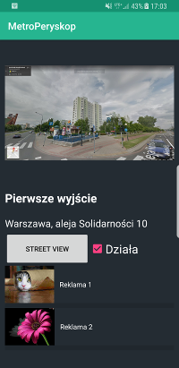
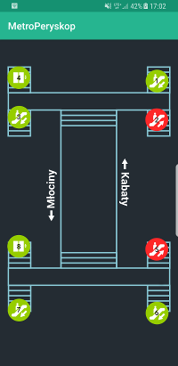

# metro peryskop
Application helping people get out of subway using the right exit. It was created during
Wawcode hackathon and awarded with second prize. It uses QR codes and nfc tags to read
information about exit and present user a photo showing what is above him.
To use it you have to first set up a server(see [here](https://github.com/kczarnota/metro_peryskop_server)),
then provide it's IP address in utils/Constants.java.

# Used libraries
* nisrulz/qreader
* butterknife
* retrofit
* gson

Screeshots:

